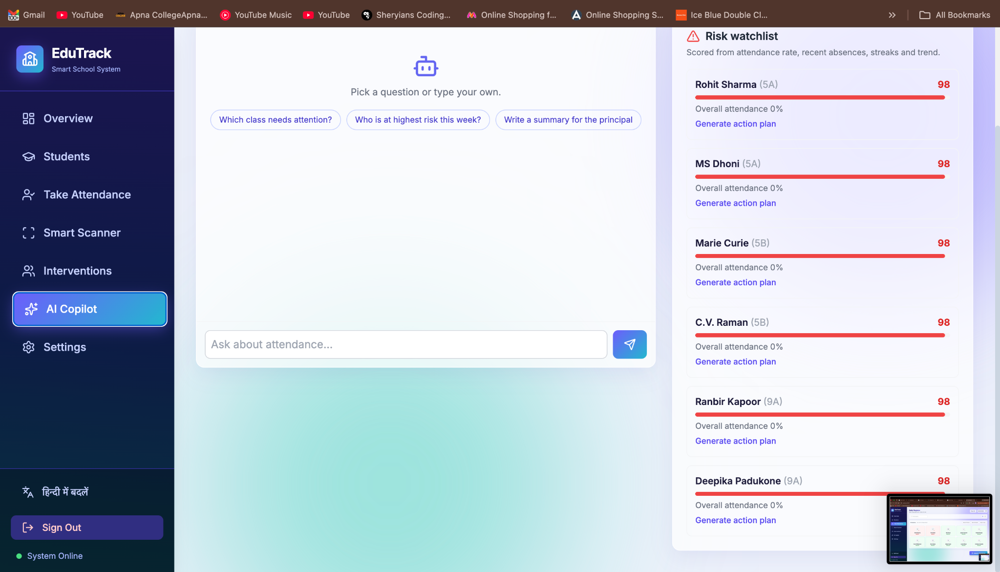
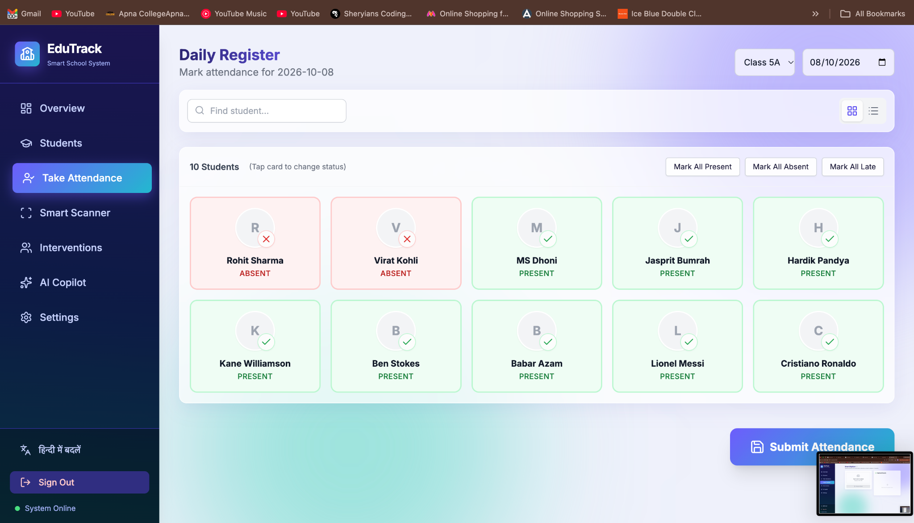
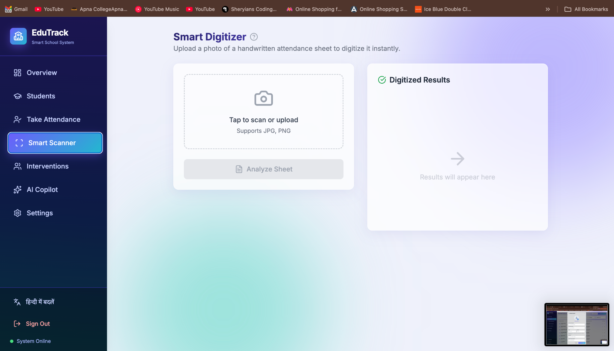
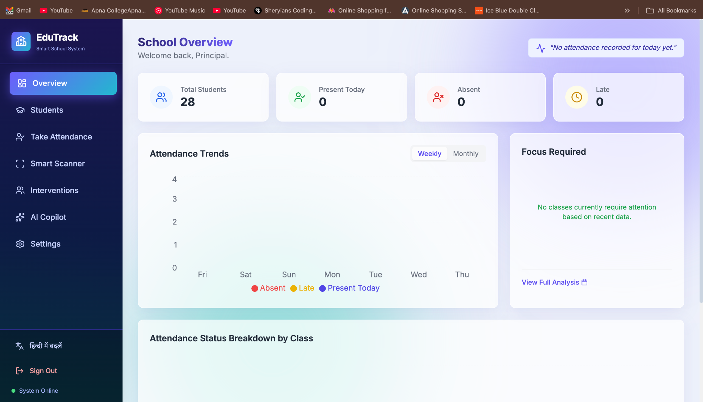
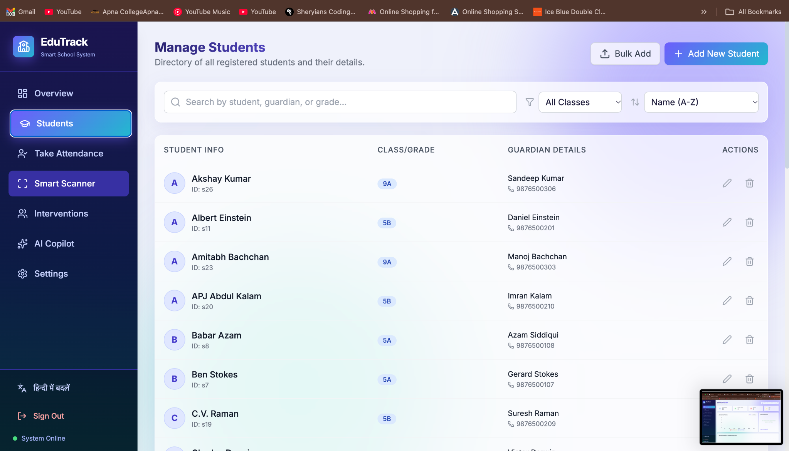
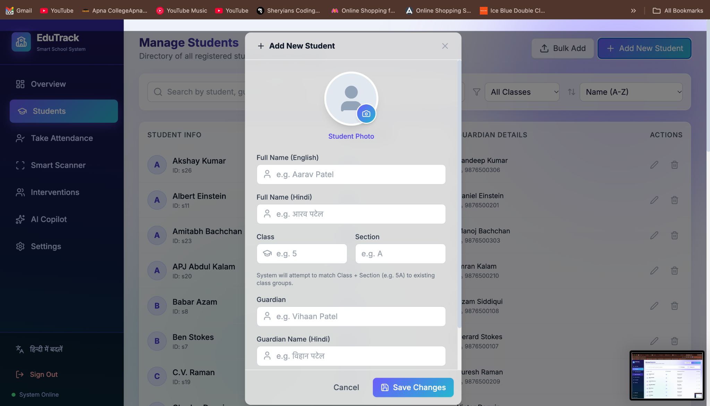
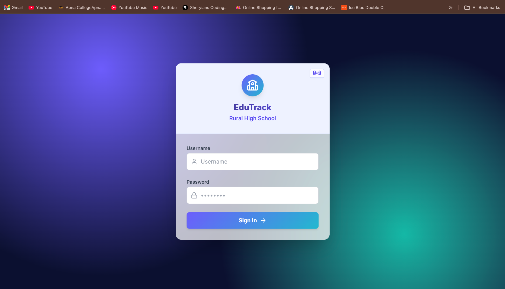

# EduTrack Pro
AI attendance system for rural schools (React + TypeScript + Vite + Gemini).

## Run
```
npm install
cp .env.local.example .env.local   # then paste your GEMINI_API_KEY
npm run dev                        # http://localhost:3000  (login: admin / password)
```
Open **AI Copilot** and click **Load 4-week demo data** to fill the dashboard, risk model and AI answers.

## AI features
- Scanner: handwritten register photo -> structured attendance (Gemini vision)
- AI Copilot: chat that answers from live school data (grounded prompt)
- Risk prediction: local scoring from rate, recent absences, streaks and trend
- One-click action plans and parent SMS drafts, with offline fallbacks


## 📸 Project Screenshots
      